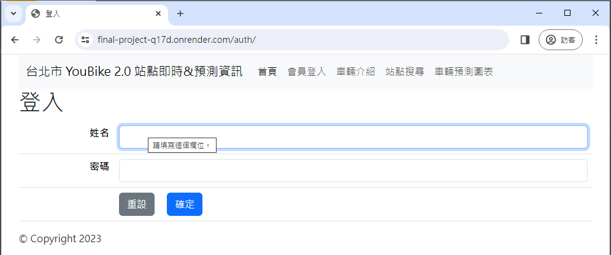
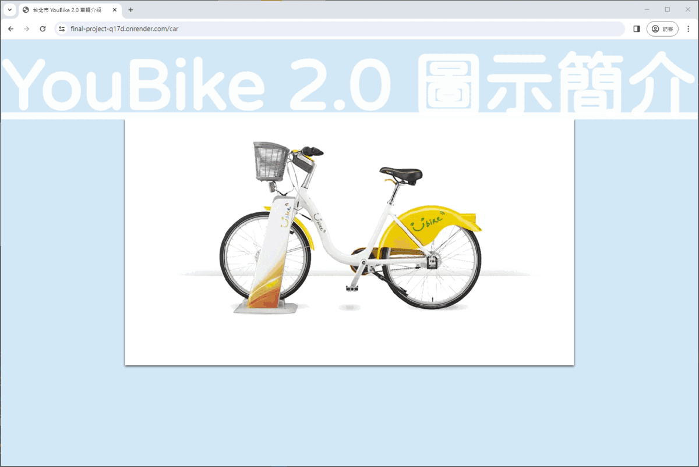
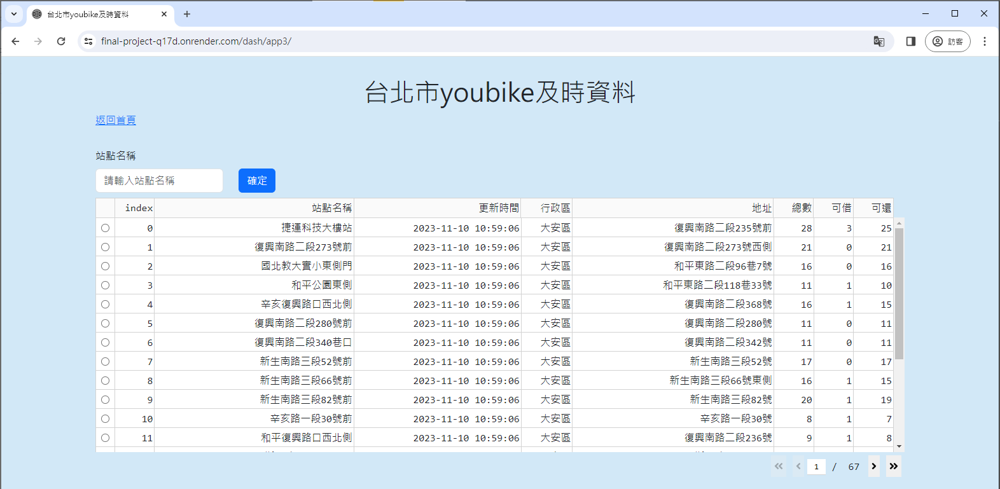
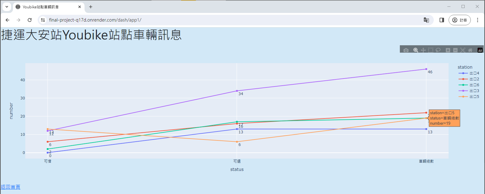

# 網頁專題 - 台北市YouBike站點即時&預測資訊
### 一、專案名稱：
台北市YouBike站點即時&預測資訊
### 二、專案組員：
組長：陳建任  
組員：張盛枋、劉峻宏
### 三、專案目的：
查詢台北市YouBike站點即時&預測資訊
### 四、專案簡介：
1. 首頁  

2. 會員登入  

3. 車輛介紹  

4. 站點搜尋  

5. 車輛預測圖表  

### 五、Render 網址：
[Render連結](https://final-project-q17d.onrender.com)
### 六、資料來源：
[YouBike2.0臺北市公共自行車即時資訊 | 政府資料開放平臺](https://data.gov.tw/dataset/137993)